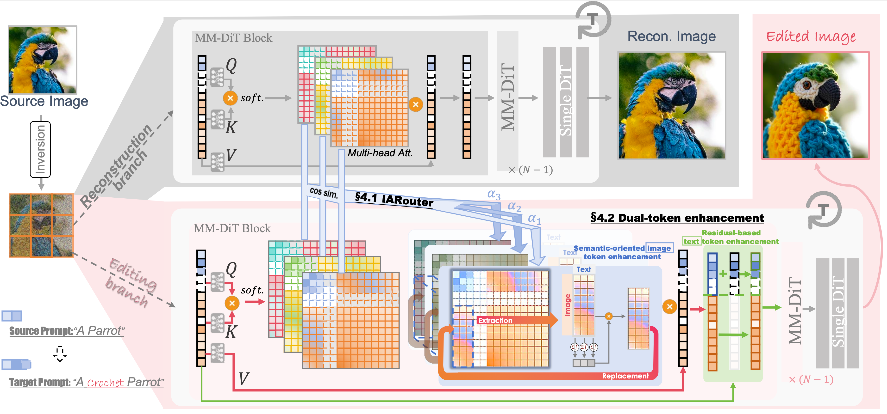

# HeadRouter: A Training-free Image Editing Framework for MM-DiTs by Adaptively Routing Attention Heads


<a href='https://yuci-gpt.github.io/headrouter/'></a>
<a href='https://dl.acm.org/doi/10.1145/3797956'></a>
<a href='https://arxiv.org/abs/2411.15034'></a> 
</div>


## TL; DR
HeadRouter is a training-free text guided real image editing framework that based on MM-DiT (e.g. SD3 and Flux).

## Abstract
Diffusion Transformers (DiTs) have exhibited robust capabilities in image generation tasks. However, accurate text-guided image editing for multimodal DiTs (MM-DiTs) still poses a significant challenge. Unlike UNet-based structures that could utilize self/cross-attention maps for semantic editing, MM-DiTs inherently lack support for explicit and consistent incorporated text guidance, resulting in semantic misalignment between the edited results and texts. In this study, we disclose the sensitivity of different attention heads to different image semantics within MM-DiTs and introduce HeadRouter, a training-free image editing framework that edits the source image by adaptively routing the text guidance to different attention heads in MM-DiTs. Furthermore, we present a dual-token refinement module to refine text/image token representations for precise semantic guidance and accurate region expression. Experimental results on multiple benchmarks demonstrate HeadRouter's performance in terms of editing fidelity and image quality.


## Installation & Usage

1. **Clone the repository and install the environment:**
   ```bash
   git clone [https://github.com/your-repo/HeadRouter.git](https://github.com/your-repo/HeadRouter.git)
   cd HeadRouter/diffusers
   pip install -e .

2. **Run Inference:**
   You can run the inference script using:
   ```bash
   python infer.py
   ```

> **Important Note on Hyper-parameters:**
> Please note that training-free image editing relies heavily on hyper-parameter tuning. You will need to adjust the hyper-parameters based on the specific input image and the type of editing you want to perform. 

Below is our recommended hyper-parameter configuration for various inversion and editing tasks:

**Hyper-parameter configuration of our method for inversion and editing tasks**

| Task | Starting Time (s) | Stopping Time (τ) | Strength (η) |
| :--- | :---: | :---: | :---: |
| Object insert | 0 | 6 | 1.0 |
| Gender editing | 0 | 8 | 1.0 |
| Age editing | 0 | 5 | 1.0 |
| Adding glasses | 6 | 25 | 0.7 |
| Stylization | 0 | 6 | 0.9 |

*(Note: Stopping Time and Strength are parameters for Controller Guidance η_t)*

## Pipeline


## Comparison with baselines


## More of our results


